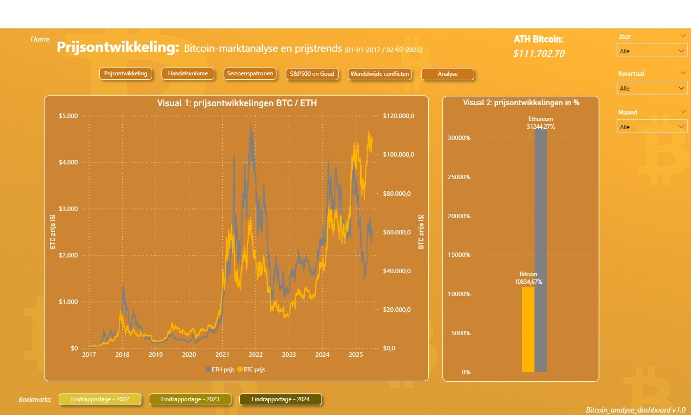

# Bitcoin analyse dashboard v1.0

*In dit dashboard worden diverse analyses en trends weergegeven waarin Bitcoin centraal staat. Er wordt gekeken naar prijsontwikkeling, handelsvolume, seizoenspatronen en de invloed van geweldsconflicten in de wereld. Ook worden er vergelijkingen met Ethereum gedaan en anders koersen zoals: goud en de S\&P500 (Amerikaanse aandelen index) Voor elk onderwerp is er een aparte pagina met duidelijke visuals. Op de laatste pagina (Analyse) worden een 6-tal onderzoeksvragen over de Bitcoin behandeld.*

## Installatie-instructies

Inpricipe werkt het PBI dashboard zonder specifieke installatie stappen, als men echter een data refresh wilt doen zal er een foutmelding worden weergegeven omdat de paden naar de databronnen niet meer kloppen , om dit op te lossen:

* Zet de bijgeleverd databestanden ergens lokaal op je computer
* Open het dashboard in Power BI
* Ga naar Query editor in PBI
* Klik op Geavanceerde editor
* Pas de paden aan naar de juiste locaties waar je de databestanden hebt naar gezet en klik op Gereed
* Deze actie herhalen voor elke query/dataset, makkelijkste is om de hele code te kopieren en volledig in de andere 3 queries te plakken.
* Klik linksboven op Sluiten en toepassen
* De aanpassingen in de queries is toegepast.

#### Vereisten:

* Microsoft Power Bi (.pbix bestand openen)
* Jupyter Notebook  (.ipynb bestand openen)
* Eventueel Excel om de CSV bestanden vooraf te bekijken.

## Gebruikte datasets

Bitcoin\_historical\_data\_coinmarketcap.csv
Link: https://coinmarketcap.com/currencies/bitcoin/historical-data/
Ethereum\_historical\_data\_coinmarketcap.csv
Link: https://coinmarketcap.com/currencies/ethereum/historical-data/
Gold Futures Historical Data.csv
Link: https://www.investing.com/commodities/gold
S\&P 500 Historical Data.csv
Link: https://www.investing.com/indices/us-spx-500
UcdpPrioConflict\_v25\_1.csv
Link: https://ucdp.uu.se/downloads/

## Inlezen data

Voor het inlezen van de data heb gekozen om dit te doen via de optie: python-script. Omdat ik de data cleaning via python heb gedaan vond ik dit een logische stap.

## Totaal ingeleverde bestanden

* Bitcoin\_analyse\_dashboard\_v1.0.pbix
* Data Analytics Project.ipynb
* README.md
* CSV-bestanden met data

## Navigatie in het dashboard

**Pagina navigatie:**
Het dashboard heeft 6 navigatiebuttons om te navigeren tussen de verschillende paginas: Prijstontwikkeling, Handelsvolume, Seizoenspatronen, S&P500 en Goud, Wereldwijde conflicten en Analyse. Klik met de muiscursor op de button en houd CRTL ingedrukt om te navigeren.
**Filters op specifieke periode:**
Rechtsboven in de pagina staan 3 filters: Jaar – Kwartaal – Maand. Hier kan men een specifieke selectie maken om analyses en trends te bekijken voor de geselecteerde periode.
**Bookmarks:**
Op de hoofdpagina staan 3 bookmarks, deze laten de cijfers zijn over de jaren 2022, 2023 en 2024. Ook hier geldt CTRL ingedrukt houden en klikken met de muiscursor.

## Dashboardfuncties

#### Pagina – Prijsontwikkeling

**Visual 1:** Lijngrafiek, met de prijskoersen van BTC en ETH. 
**Visual 2:** Kolomdiagram, met de prijsontwikkeling in % van BTC/ETH, welke wordt berekend door een DAX-berekening. 
**ATB Bitcoin visuele kaart:** geeft de alltime high weer van Bitcoin op basis van geselecteerde periode. 
**Filters:** hiermee kan de gebruiker selecteren op basis van Jaar-Kwartaal-Maand. 
**Paginabuttons:** hiermee kan de gebruikers navigeren tussen de pagina’s van het dashboard. 

#### Pagina – Handelsvolume

**Visual 3.1:** Spreidingsdiagram, geeft de relatie weer tussen prijs en volume voor BTC. 
**Visual 3.2:** Spreidingsdiagram, geeft de relatie weer tussen prijs en volume voor ETH. 
**Filters:** hiermee kan de gebruiker selecteren op basis van Jaar-Kwartaal-Maand. 
**Paginabuttons:** hiermee kan de gebruikers navigeren tussen de pagina’s van het dashboard. 

#### Pagina – Seizoenspatronen

**Visual 4.1:** Lijngrafiek, met de gemiddelde prijs van ETH/BTC per maand/seizoen en een MIN en MAX arcering om duidelijk weer te geven in welk seizoenen de gemiddelde High/Low waardes plaatsvinden. 
**Visual 4.2:** Heatmap matrix ETH, geeft met kleurovergangen (d.m.v. van DAX) aan of een prijs laag-gemiddeld-hoog is. Hierdoor kan er per seizoen goed gekeken worden naar de ontwikkeling van de prijs. 
**Visual 4.3:** Heatmap matrix BTC, geeft met kleurovergangen (d.m.v. van DAX) aan of een prijs laag-gemiddeld-hoog is. Hierdoor kan er per seizoen goed gekeken worden naar de ontwikkeling van de prijs. 
**Filters:** hiermee kan de gebruiker selecteren op basis van Jaar-Kwartaal-Maand. 
**Paginabuttons:** hiermee kan de gebruikers navigeren tussen de pagina’s van het dashboard. 

#### Pagina – S\&P500 en Goud

**Visual 5.1:** Lijngrafiek, geeft de koersen weer van S\&P500 en Bitcoin. 
**Visual 5.2:** Lijngrafiek, geeft de koersen weer van Goud en Bitcoin. 
**Visual 5.3:** Spreidingsdiagram, geeft de koersen weer van S\&P500 en Bitcoin en eventuele correlatie. 
**Visual 5.4:** Spreidingsdiagram, geeft de koersen weer van Goud en Bitcoin en eventuele correlatie. 
**Filters:** hiermee kan de gebruiker selecteren op basis van Jaar-Kwartaal-Maand. 
\*\*Paginabuttons: \*\*hiermee kan de gebruikers navigeren tussen de pagina’s van het dashboard. 

#### Pagina – Wereldwijde conflicten

**Visual 6.1:** Lijngrafiek met kolomdiagram, geeft de BTC koers weer met conflicten toegevoegd als kolommen om meetpunten te creëren. 
**Visual 6.2:** Lijngrafiek met kolomdiagram, geeft de S\&P500 koers weer met conflicten toegevoegd als kolommen om meetpunten te creëren. 
**Visual 6.3:** Lijngrafiek met kolomdiagram, geeft de Goud koers weer met conflicten toegevoegd als kolommen om meetpunten te creëren. 
**Filters:** hiermee kan de gebruiker selecteren op basis van Jaar-Kwartaal-Maand. 
**Paginabuttons:** hiermee kan de gebruikers navigeren tussen de pagina’s van het dashboard. 

#### Pagina - Analyse

**Paginabuttons:** hiermee kan de gebruikers navigeren tussen de pagina’s van het dashboard. 
**Tekstvak:** hier staan de onderzoeksvragen beantwoord. 

## Datum Tabel

De verschillende tabellen zijn met elkaar gerelateerd door de datumtabel welke centraal staat. Hierdoor kan er efficient en betrouwbaar gefilterd worden op specifieke periodes.

De datumtabel is samengesteld met de volgende code:

*date\_table =
ADDCOLUMNS(
CALENDAR(DATE(2017,1,1), DATE(2025,12,31)),
"Year", YEAR(\[Date]),
"Month Number", MONTH(\[Date]),
"Month Name", FORMAT(\[Date], "MMMM"),
"Quarter", "Q" \& FORMAT(\[Date], "Q"),
"Weekday", FORMAT(\[Date], "dddd"),
"Year-Month", FORMAT(\[Date], "YYYY-MM")
)*

## DAX

Ik heb  DAX gebruikt om berekeningen uit te voeren. De toelichting van deze codes is beschreven in de DAX-code zelf in PBI.

